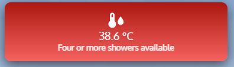
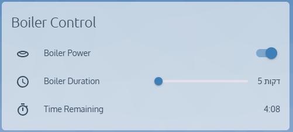
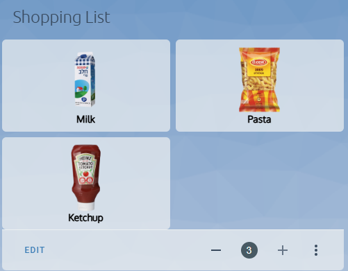
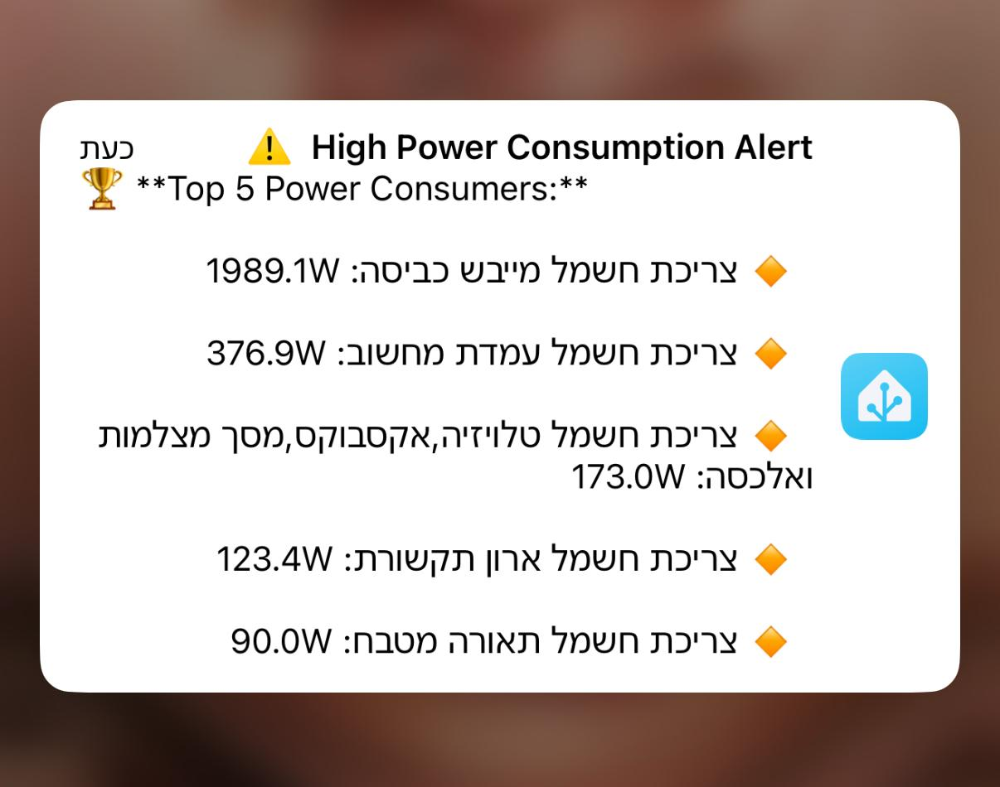
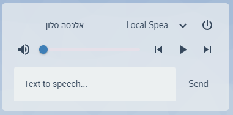

# 🏠 Home Assistant Guides  
🚀 A collection of Home Assistant guides, automation setups, and YAML configurations.  

This repository contains step-by-step tutorials for enhancing your smart home experience using Home Assistant.  

---

## 📌 Available Guides  

### **1️⃣ Boiler Temperature Card**  
📌 **Custom card for monitoring boiler temperature and shower availability.**  
🔗 **[Read the guide](boiler-temperature-card/README.md)**  
   - 🇮🇱 **מדריך בעברית:** [כרטיס טמפרטורת הדוד עם חיווי צבעוני וזמינות מקלחות](boiler-temperature-card/עברית/README.md)  

  
  

---

### **2️⃣ Boiler Slider Timer**  
📌 **Set a custom timer for boiler activation using a slider.**  
🔗 **[Read the guide](boiler_slider_timer/README.md)**  
   - 🇮🇱 **מדריך בעברית:** [טיימר הפעלת הדוד בהתאמה אישית עם סליידר](boiler_slider_timer/עברית/README.md)  

  
  

---

### **3️⃣ Smart Shopping List**  
📌 **Create a dynamic shopping list with custom product buttons and images.**  
🔗 **[Read the guide](smart-shopping-list/README.md)**  
   - 🇮🇱 **מדריך בעברית:** [רשימת קניות חכמה עם כפתורי מוצרים ותמונות מותאמות אישית](smart-shopping-list/עברית/README.md)  

  
  

---

### **4️⃣ Power Consumption Alert**  
📌 **Get alerts for high power consumption and top-consuming devices.**  
🔗 **[Read the guide](power-consumption-alert/README.md)**  
   - 🇮🇱 **מדריך בעברית:** [התראה על צריכת חשמל גבוהה והצגת 5 הצרכנים הגדולים](power-consumption-alert/עברית/README.md)  

  
  

---

### **5️⃣ Alexa TTS Card**  
📌 **Send voice messages to your Alexa device using a Lovelace card.**  
🔗 **[Read the guide](alexa-tts-card/README.md)**  
   - 🇮🇱 **מדריך בעברית:** [כרטיס לשליחת הודעות קוליות לרמקול אלכסה](alexa-tts-card/עברית/README.md)  

  
  

---

## 🔹 How to Use These Guides  
Each guide is in its own folder and contains:  
- **README.md** → Full instructions with images.  
- **YAML files** → Ready-to-use Home Assistant configurations.  
- **Images** → Screenshots and examples.  

## 📬 Contributions & Feedback  
Feel free to open an issue if you have questions or want to suggest new guides!  

---  
🔗 **Follow me for more Home Assistant content!**  

📣 **Join our Facebook group:**  **Home Assistant - קהילה ומדריכים** 
🔗 **https://www.facebook.com/groups/homeassistant.israel**  
