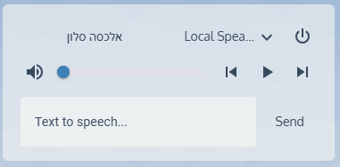

# 🔊 **Alexa Mini Media Player with TTS in Home Assistant**  

This guide will show you how to **set up a Lovelace card** that integrates Alexa **with text-to-speech (TTS)**, allowing you to send custom messages to your Echo device.  

  

---

## 🛠️ **Requirements**  
✅ **Alexa device integrated with `alexa_media_player`**  
✅ **HACS installed with `mini-media-player`**  

---

## 🔹 **Step 1: Installing Alexa Media Player Integration**  
To control Alexa devices in Home Assistant, you need to install `alexa_media_player` from HACS.  

📌 **Follow these steps to install:**  
1️⃣ Open **HACS** → **Integrations**  
2️⃣ Search for **Alexa Media Player**  
3️⃣ Click **Download & Install**  
4️⃣ Restart Home Assistant  
5️⃣ Go to **Settings → Integrations** and configure your **Amazon account login**  

---

## 🔹 **Step 2: Installing `mini-media-player` for Lovelace**  
To display an advanced media player card, install `mini-media-player` via HACS.  

📌 **Steps:**  
1️⃣ Open **HACS** → **Frontend**  
2️⃣ Search for **mini-media-player**  
3️⃣ Click **Download & Install**  
4️⃣ Restart Home Assistant  

---

## 🔹 **Step 3: Creating the Alexa Media Player Card**  
Once the integrations are installed, add the following YAML to your **Lovelace dashboard** to create the Alexa media player card.  

📌 **Add this to your Lovelace YAML configuration:**  

```yaml
type: custom:mini-media-player
entity: media_player.noy_s_2nd_echo_dot_2
artwork: full-cover
icon: mdi:amazon
tts:
  platform: alexa
  entity_id: media_player.noy_s_2nd_echo_dot_2
```

---

## 🔹 **Step 4: Understanding the Configuration**  

### 📌 Features of the Card  
✅ **Displays Alexa's current status and artwork (if playing music)**  
✅ **Shows volume controls and playback buttons**  
✅ **Allows sending custom TTS messages**  

### 📌 What should you change?  
➡️ Update **`entity: media_player.noy_s_2nd_echo_dot_2`** to match your Alexa device entity.  
➡️ Ensure that **`platform: alexa`** is properly set for TTS support.  
➡️ Modify the **icon or artwork display** according to your preference.  

---

## 🔹 **Step 5: Sending a TTS Message to Alexa**  
With this card, you can enter text, and Alexa will **speak the message aloud** on the selected device.  

📌 **How to use?**  
1️⃣ Open your Lovelace dashboard  
2️⃣ Click the **TTS input field** in the media player card  
3️⃣ Type any message (e.g., "Dinner is ready!")  
4️⃣ Alexa will **speak the message aloud** on the device  

---

## 🚀 **Summary**  
✅ **Added Alexa to Home Assistant using `alexa_media_player`**  
✅ **Installed `mini-media-player` for a better UI**  
✅ **Created a Lovelace card with TTS support**  
✅ **Now you can send spoken messages to Alexa from Home Assistant!**  

---

## 📬 **Need Help?**  
If you have any issues, open an issue or submit a pull request! 🚀  

🔗 **Follow for more Home Assistant projects!**  
