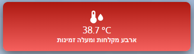

# 🔥 Boiler Temperature Card with Dynamic Colors and Shower Availability in Home Assistant

This guide will walk you through creating a **fully customized Lovelace card** for **boiler temperature monitoring** with **dynamic color indicators, an adaptive icon, and real-time shower availability based on temperature**.

 

---

## 🛠️ Requirements  
✅ **A boiler temperature sensor** (e.g., `sensor.boiler_temperature_2`)  
✅ **HACS installed with `custom:button-card`**  

---

## 🔹 Step 1: Create the Custom Lovelace Boiler Temperature Card  

To display boiler temperature visually with **color-coded backgrounds, dynamic icons, and shower availability labels**, add the following YAML to your **Lovelace Dashboard**:  

📌 **Paste this code into your Lovelace YAML configuration:**  

```yaml
type: custom:button-card
entity: sensor.boiler_temperature_2
name: " "
show_state: true
show_label: true
icon: >
  [[[ if (entity.state < 25) return 'mdi:snowflake'; return
  'mdi:thermometer-water'; ]]]
styles:
  card:
    - width: 377px
    - height: 100px
    - background: |
        [[[ 
          if (entity.state > 35) return "linear-gradient(to top, #ff5a5a, #b30000)";
          if (entity.state >= 30) return "linear-gradient(to top, #ffaa5a, #ff751a)";
          if (entity.state < 25) return "linear-gradient(to top, #add8e6, #87ceeb)";
          return "linear-gradient(to top, #5aaaff, #0059b3)";
        ]]]
    - border-radius: 10px
    - box-shadow: 0px 6px 20px rgba(0, 0, 0, 0.6)
    - color: white
    - font-size: 18px
    - padding: 15px
    - text-align: center
  icon:
    - color: white
    - size: 30px
  label:
    - font-size: 14px
    - font-weight: bold
    - color: rgba(255, 255, 255, 0.85)
label: |
  [[[ 
    if (entity.state < 25) return 'Not enough hot water for a shower';
    if (entity.state <= 28) return 'One shower available';
    if (entity.state <= 31) return 'Two showers available';
    if (entity.state <= 34) return 'Three showers available';
    return 'Four or more showers available';
  ]]]
```

---

## 🔹 Step 2: Understanding the Configuration  

### 📌 Dynamic Background Colors  

The background color of the card changes dynamically based on temperature:

- **Below 25°C** → ❄️ Light Blue (Insufficient hot water)
- **Between 25°C - 29°C** → 🔵 Blue (Minimal hot water)
- **Between 30°C - 34°C** → 🟠 Orange (Good for showers)
- **Above 35°C** → 🔴 Red (Plenty of hot water)

📌 **If you need to adjust temperature thresholds, modify the background values:**

```yaml
if (entity.state > 35) return "linear-gradient(to top, #ff5a5a, #b30000)";  # Red (Hot water ready)
if (entity.state >= 30) return "linear-gradient(to top, #ffaa5a, #ff751a)"; # Orange (Good showers)
if (entity.state < 25) return "linear-gradient(to top, #add8e6, #87ceeb)";  # Light Blue (Not enough)
return "linear-gradient(to top, #5aaaff, #0059b3)";  # Blue (Minimal hot water)
```

### 📌 Dynamic Icons  

If the temperature is below 25°C, the icon changes to ❄️ `mdi:snowflake` (Cold water).  
Otherwise, it defaults to `mdi:thermometer-water` to indicate hot water.

```yaml
icon: >
  [[[ if (entity.state < 25) return 'mdi:snowflake'; return 'mdi:thermometer-water'; ]]]
```

### 📌 Shower Availability Calculation  

- **Below 25°C** → "Not enough hot water for a shower"
- **Between 25°C - 28°C** → "One shower available"
- **Between 29°C - 31°C** → "Two showers available"
- **Between 32°C - 34°C** → "Three showers available"
- **Above 34°C** → "Four or more showers available"

📌 **If you need to customize when showers become available, update the `label` values:**

```yaml
label: |
  [[[ 
    if (entity.state < 25) return 'Not enough hot water for a shower';
    if (entity.state <= 28) return 'One shower available';
    if (entity.state <= 31) return 'Two showers available';
    if (entity.state <= 34) return 'Three showers available';
    return 'Four or more showers available';
  ]]]
```

---

## 🔹 Step 3: Saving and Testing  

✅ **Save the changes in Lovelace UI.**  
✅ **Ensure the temperature sensor updates correctly.**  
✅ **Verify that colors change dynamically based on boiler temperature.**  
✅ **Adjust temperature thresholds and colors if needed.**  


---

## 🚀 Summary  

🎨 **This card dynamically changes colors, icons, and labels based on real-time temperature readings.**  
🔥 **Customize temperature thresholds to match your boiler’s heating behavior.**  
✅ **Ensure your sensor entity (`sensor.boiler_temperature_2`) is correctly set.**  

---

## 📬 Need Help?  

If you have questions or want to improve this setup, feel free to open an issue or submit a pull request! 🚀  

🔗 **Follow for more Home Assistant projects!**  
📣 **Join our Facebook group:**  **Home Assistant - קהילה ומדריכים** 
🔗 **https://www.facebook.com/groups/homeassistant.israel**  
