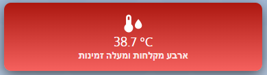

# 🔥 **כרטיס טמפרטורת הדוד עם צבעים דינמיים וזמינות מקלחות ב-Home Assistant**  

**כיצד ליצור כרטיס Lovelace מותאם אישית** להצגת **טמפרטורת הדוד**, עם **צבעים משתנים**, **אייקון דינמי**, ו **אינדיקציה לכמות המקלחות הזמינות** בהתאם לטמפרטורה.

   

---

## 🛠️ **דרישות מקדימות**  
✅ **חיישן טמפרטורת הדוד** (לדוגמה: `sensor.boiler_temperature_2`)  
✅ **HACS מותקן עם `custom:button-card`**  

---

## 🔹 **שלב 1: יצירת כרטיס Lovelace מותאם אישית לדוד**  

כדי להציג את טמפרטורת הדוד בצורה ויזואלית עם **רקע צבעוני שמשתנה**, **אייקונים דינמיים**, ו **תוויות המציגות זמינות מקלחות**, יש להוסיף את הקוד הבא ל-Lovelace:

📌 **הוסף את הקוד הבא לקובץ YAML של Lovelace:**  

```yaml  
type: custom:button-card  
entity: sensor.boiler_temperature_2  
name: " "  
show_state: true  
show_label: true  
icon: >  
  [[[ if (entity.state < 25) return 'mdi:snowflake'; return  
  'mdi:thermometer-water'; ]]]  
styles:  
  card:  
    - width: 377px  
    - height: 100px  
    - background: |  
        [[[  
          if (entity.state > 35) return "linear-gradient(to top, #ff5a5a, #b30000)";  
          if (entity.state >= 30) return "linear-gradient(to top, #ffaa5a, #ff751a)";  
          if (entity.state < 25) return "linear-gradient(to top, #add8e6, #87ceeb)";  
          return "linear-gradient(to top, #5aaaff, #0059b3)";  
        ]]]  
    - border-radius: 10px  
    - box-shadow: 0px 6px 20px rgba(0, 0, 0, 0.6)  
    - color: white  
    - font-size: 18px  
    - padding: 15px  
    - text-align: center  
  icon:  
    - color: white  
    - size: 30px  
  label:  
    - font-size: 14px  
    - font-weight: bold  
    - color: rgba(255, 255, 255, 0.85)  
label: |  
  [[[  
    if (entity.state < 25) return 'אין מספיק מים למקלחת';  
    if (entity.state <= 28) return 'מקלחת אחת זמינה';  
    if (entity.state <= 31) return 'שתי מקלחות זמינות';  
    if (entity.state <= 34) return 'שלוש מקלחות זמינות';  
    return 'ארבע מקלחות ומעלה זמינות';  
  ]]]  
```  

---

## 🔹 **שלב 2: הבנת הקונפיגורציה**  

### 📌 **שינוי צבע הרקע דינמית לפי טמפרטורה**  

הרקע של הכרטיס משתנה באופן אוטומטי בהתאם לטמפרטורה:

- **מתחת ל-25°C** → ❄️ **כחול בהיר** (אין מספיק מים חמים)  
- **בין 25°C - 29°C** → 🔵 **כחול** (כמות מים חמים מינימלית)  
- **בין 30°C - 34°C** → 🟠 **כתום** (מתאים למקלחת)  
- **מעל 35°C** → 🔴 **אדום** (מים חמים זמינים בשפע)  

📌 **אם תרצה להתאים את סף הטמפרטורות, שנה את הקוד הבא:**  

```yaml  
if (entity.state > 35) return "linear-gradient(to top, #ff5a5a, #b30000)";  # אדום (מים חמים זמינים)  
if (entity.state >= 30) return "linear-gradient(to top, #ffaa5a, #ff751a)"; # כתום (מים טובים למקלחת)  
if (entity.state < 25) return "linear-gradient(to top, #add8e6, #87ceeb)";  # כחול בהיר (לא מספיק חם)  
return "linear-gradient(to top, #5aaaff, #0059b3)";  # כחול (חימום מינימלי)  
```  

---

### 📌 **שינוי אייקון דינמי לפי טמפרטורה**  

📌 כאשר הטמפרטורה **נמוכה מ-25°C**, האייקון משתנה ל-❄️ `mdi:snowflake` (מים קרים).  
📌 אחרת, הוא נשאר **`mdi:thermometer-water`** כדי לסמן מים חמים.

```yaml  
icon: >  
  [[[ if (entity.state < 25) return 'mdi:snowflake'; return 'mdi:thermometer-water'; ]]]  
```  

---

### 📌 **חישוב זמינות המקלחות לפי הטמפרטורה**  

- **מתחת ל-25°C** → `"אין מספיק מים למקלחת"`  
- **בין 25°C - 28°C** → `"מקלחת אחת זמינה"`  
- **בין 29°C - 31°C** → `"שתי מקלחות זמינות"`  
- **בין 32°C - 34°C** → `"שלוש מקלחות זמינות"`  
- **מעל 34°C** → `"ארבע מקלחות ומעלה זמינות"`  

📌 **אם ברצונך להתאים את זמינות המקלחות, שנה את הערכים בקוד הבא:**  

```yaml  
label: |  
  [[[  
    if (entity.state < 25) return 'אין מספיק מים למקלחת';  
    if (entity.state <= 28) return 'מקלחת אחת זמינה';  
    if (entity.state <= 31) return 'שתי מקלחות זמינות';  
    if (entity.state <= 34) return 'שלוש מקלחות זמינות';  
    return 'ארבע מקלחות ומעלה זמינות';  
  ]]]  
```  

---

## 🔹 **שלב 3: שמירה ובדיקת ההגדרות**  

✅ **שמור את השינויים ב-Lovelace UI.**  
✅ **ודא שהחיישן מעדכן את הטמפרטורה בזמן אמת.**  
✅ **בדוק שהצבעים משתנים בהתאם לטמפרטורה.**  
✅ **התאם את ערכי הטמפרטורה לפי הצורך.**  

---

## 🚀 **סיכום**  

🎨 **כרטיס זה משנה צבעים, אייקונים ותוויות בהתבסס על טמפרטורה בזמן אמת.**  
🔥 **ניתן להתאים את רמות הטמפרטורה בהתאם לחימום של הדוד שלך.**  
✅ **ודא שישות החיישן (`sensor.boiler_temperature_2`) מוגדרת כהלכה.**  

---

## 📬 **צריך עזרה?**  

אם יש לך שאלות או שיפורים להציע, נשמח לשמוע! ניתן לפתוח **Issue** או **Pull Request** בפרויקט. 🚀  

🔗 **עקוב אחרינו לעוד פרויקטים של Home Assistant!**  
