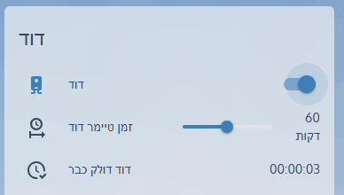

# 🔥 **Slider Timer for Boiler in Home Assistant (Manual Activation)**  

This guide will walk you through **creating a custom slider in Lovelace** that allows you to **predefine the heating time for the boiler**.  
When you turn on the boiler, it will **pull the selected time from the slider** and automatically turn off when the timer expires.  
Additionally, we will reset the slider to a default value when the boiler turns off.

 
---

## 🛠️ **Requirements**
✅ **A smart switch controlling the boiler** (e.g., `switch.boiler`)  
✅ **A timer entity in Home Assistant** (e.g., `timer.boiler_timer`)  
✅ **Lovelace YAML editing enabled**  
✅ **HACS installed for custom UI elements (optional)**  

---

## 🔹 **Step 1: Creating a Timer for the Boiler**  
First, we need to define a **timer entity** that will track the heating duration.

📌 **Add the following to your `configuration.yaml`:**  

```yaml
timer:
  boiler_timer:
    duration: "00:30:00"
    name: "Boiler Timer"
    icon: mdi:timer-outline
```

The default timer is **30 minutes**, but it can be adjusted using the slider.

---

## 🔹 **Step 2: Creating a Slider to Set Boiler Duration**  
To allow users to select the heating duration, we will create an **input_number** entity with a flexible time range.

📌 **Add this to `configuration.yaml`:**  

```yaml
input_number:
  boiler_duration:
    name: "Boiler Duration"
    min: 5
    max: 120
    step: 5
    unit_of_measurement: "minutes"
    mode: slider
    icon: mdi:clock-outline
```

🔹 The slider allows users to select a time between **5 and 120 minutes**, increasing in **5-minute steps**.

---

## 🔹 **Step 3: Automation to Start the Boiler Based on the Slider Value**  
Now, we will create an **automation** that ensures when the boiler is turned on, it pulls the **selected time** from the slider and starts the timer.

📌 **Add this to `automations.yaml`:**  

```yaml
- alias: "Start Boiler Timer from Slider"
  trigger:
    - platform: state
      entity_id: switch.boiler
      to: "on"
  action:
    - service: timer.start
      entity_id: timer.boiler_timer
      data:
        duration: >
          {{ (states('input_number.boiler_duration') | int // 60) | string | default('00') }}:{{ (states('input_number.boiler_duration') | int % 60) | string | default('00') }}:00
```

📌 **How it works?**  
✅ When the **boiler switch is turned on**, this automation will fetch the selected time from the slider.  
✅ **The timer will start accordingly.**  

---

## 🔹 **Step 4: Automation to Turn Off the Boiler When the Timer Ends**  
To prevent unnecessary heating, we will create an automation that turns off the boiler when the timer expires.

📌 **Add this to `automations.yaml`:**  

```yaml
- alias: "Turn Off Boiler When Timer Ends"
  trigger:
    - platform: event
      event_type: timer.finished
      event_data:
        entity_id: timer.boiler_timer
  action:
    - service: switch.turn_off
      target:
        entity_id: switch.boiler
```

📌 **How it works?**  
✅ When the **timer ends**, the boiler **will automatically turn off**.  
✅ Even if you adjust the slider, the boiler **won't turn on immediately**, only on the next activation.  

---

## 🔹 **Step 5: Reset the Slider When the Boiler Turns Off**  
To ensure that the slider **resets to a default value** every time the boiler turns off, we will add this automation.

📌 **Add this to `automations.yaml`:**  

```yaml
- alias: "Reset Boiler Timer Slider on Shutdown"
  triggers:
  - entity_id: switch.boiler
    to: 'off'
    trigger: state
  actions:
  - target:
      entity_id: input_number.boiler_duration
    data:
      value: 30
    action: input_number.set_value
  - action: timer.finish
    metadata: {}
    data: {}
    target:
      entity_id: timer.boiler_timer
```

📌 **What it does?**  
✅ **When the boiler turns off, the slider resets to 30 minutes** (you can change the default value if needed).  

---

## 🔹 **Step 6: Adding the Slider to Lovelace UI**  
To visually control the boiler in Lovelace, we will add a card displaying the **toggle switch**, **slider**, and **remaining time**.

📌 **Add this to your Lovelace configuration:**  

```yaml
type: entities
title: "Boiler Control"
show_header_toggle: false
entities:
  - entity: switch.boiler
    name: "Boiler Power"
  - entity: input_number.boiler_duration
    name: "Boiler Duration"
  - entity: timer.boiler_timer
    name: "Time Remaining"
```

🔹 **What will be displayed?**  
✅ **Boiler ON/OFF switch**  
✅ **Slider to set heating duration**  
✅ **Countdown timer for the remaining time**  

---

## 🔹 **Step 7: Improving the UI with a Better Slider**  
If you want a **better-looking UI**, you can install `slider-entity-row` from HACS.

📌 **After installing `slider-entity-row`, add this to Lovelace:**  

```yaml
type: entities
title: "Advanced Boiler Control"
show_header_toggle: false
entities:
  - entity: switch.boiler
    name: "Boiler Power"
  - type: custom:slider-entity-row
    entity: input_number.boiler_duration
    name: "Set Heating Time"
    full_row: true
  - entity: timer.boiler_timer
    name: "Time Left"
```

📌 **What improves here?**  
✅ **The slider is stretched across the full row**  
✅ **Modern and clean UI design**  

---

## 🔹 **Step 8: Testing Everything**  
🔹 **Follow these steps to test your setup:**  
✅ **Turn on the boiler and check if it pulls the time from the slider.**  
✅ **Verify that the timer displays the correct countdown.**  
✅ **Ensure the boiler turns off automatically when the timer expires.**  
✅ **Check that the slider resets to the default value when the boiler turns off.**  

---

## 🚀 **Summary**  
✅ **We created a smart boiler control system with a custom timer.**  
✅ **The boiler activates based on the slider value, but only when manually turned on.**  
✅ **An automatic shutdown is triggered when the timer expires.**  
✅ **The slider resets to its default value when the boiler turns off.**  
✅ **This setup can be further enhanced with notifications, advanced UI elements, and automation tweaks.**  

---

## 📬 **Need Help?**  
If you have any questions or want to improve this setup, feel free to open an issue or submit a pull request! 🚀  


