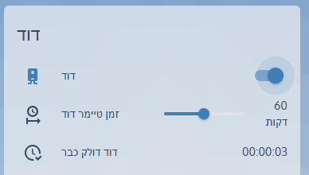
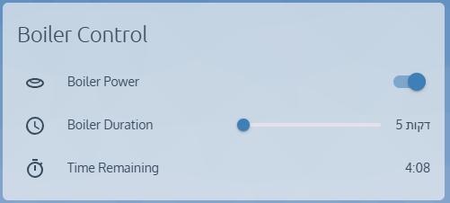

# 🔥 **טיימר חכם לדוד עם סליידר ב-Home Assistant (הפעלה ידנית)**  

מדריך זה ילמד אותך **כיצד ליצור סליידר מותאם אישית ב-Lovelace** שיאפשר לך **להגדיר מראש את זמן החימום של הדוד**.  
כאשר תדליק את הדוד, הוא **ימשוך את הזמן שנבחר בסליידר** וייכבה אוטומטית כאשר הזמן יסתיים.  
בנוסף, הסליידר **יאופס לערך ברירת מחדל כאשר הדוד יכובה**.

 

---

## 🛠️ **דרישות מקדימות**
✅ **מתג חכם לשליטה על הדוד** (לדוגמה: `switch.boiler`)  
✅ **ישות טיימר ב-Home Assistant** (לדוגמה: `timer.boiler_timer`)  
✅ **הפעלת מצב YAML בלוח הבקרה של Lovelace**  
✅ **HACS מותקן (לאלמנטים UI מתקדמים - אופציונלי)**  

---

## 🔹 **שלב 1: יצירת טיימר עבור הדוד**  
ראשית, נגדיר **ישות טיימר** שתעקוב אחר זמן החימום.

📌 **הוסף את השורות הבאות ל-`configuration.yaml`:**  

```yaml  
timer:  
  boiler_timer:  
    duration: "00:30:00"  
    name: "טיימר הדוד"  
    icon: mdi:timer-outline  
```  

🔹 **ברירת המחדל של הטיימר היא 30 דקות**, אך ניתן לשנות אותה דרך הסליידר.

---

## 🔹 **שלב 2: יצירת סליידר לקביעת זמן החימום**  
כדי לאפשר למשתמשים לבחור את משך החימום, נגדיר **ישות `input_number` עם טווח זמנים גמיש**.

📌 **הוסף את הקוד הבא ל-`configuration.yaml`:**  

```yaml  
input_number:  
  boiler_duration:  
    name: "משך הפעלת הדוד"  
    min: 5  
    max: 120  
    step: 5  
    unit_of_measurement: "דקות"  
    mode: slider  
    icon: mdi:clock-outline  
```  

🔹 הסליידר מאפשר למשתמשים לבחור זמן **בין 5 ל-120 דקות**, בקפיצות של **5 דקות**.

---

## 🔹 **שלב 3: אוטומציה להפעלת הדוד על פי ערך הסליידר**  
כעת ניצור **אוטומציה** כך שכאשר מדליקים את הדוד, הוא ימשוך את **הערך מהסליידר** ויתחיל את הטיימר.

📌 **הוסף את הקוד הבא ל-`automations.yaml`:**  

```yaml  
- alias: "הפעלת טיימר הדוד לפי הסליידר"  
  trigger:  
    - platform: state  
      entity_id: switch.boiler  
      to: "on"  
  action:  
    - service: timer.start  
      entity_id: timer.boiler_timer  
      data:  
        duration: >  
          {{ (states('input_number.boiler_duration') | int // 60) | string | default('00') }}:{{ (states('input_number.boiler_duration') | int % 60) | string | default('00') }}:00  
```  

📌 **איך זה עובד?**  
✅ כאשר **מתג הדוד מופעל**, האוטומציה מושכת את הזמן מהסליידר.  
✅ **הטיימר יתחיל לפעול בהתאם לזמן שנבחר.**  

---

## 🔹 **שלב 4: אוטומציה לכיבוי הדוד בסיום הטיימר**  
כדי למנוע חימום מיותר, נגדיר אוטומציה שמכבה את הדוד כאשר הטיימר מסתיים.

📌 **הוסף את הקוד הבא ל-`automations.yaml`:**  

```yaml  
- alias: "כיבוי הדוד בסיום הטיימר"  
  trigger:  
    - platform: event  
      event_type: timer.finished  
      event_data:  
        entity_id: timer.boiler_timer  
  action:  
    - service: switch.turn_off  
      target:  
        entity_id: switch.boiler  
```  

📌 **איך זה עובד?**  
✅ כאשר **הטיימר מסתיים**, הדוד **ייכבה אוטומטית**.  
✅ גם אם תשנה את הסליידר, הדוד **לא ידלק מיד**, אלא רק בהפעלה הבאה.  

---

## 🔹 **שלב 5: איפוס הסליידר כאשר הדוד נכבה**  
כדי לוודא שהסליידר **יאופס לערך ברירת מחדל** בכל פעם שהדוד מכובה, נוסיף אוטומציה נוספת.

📌 **הוסף את הקוד הבא ל-`automations.yaml`:**  

```yaml  
- alias: "איפוס משך טיימר הדוד עם הכיבוי"  
  trigger:  
    - platform: state  
      entity_id: switch.boiler  
      to: "off"  
  action:  
    - service: input_number.set_value  
      target:  
        entity_id: input_number.boiler_duration  
      data:  
        value: 30  
    - service: timer.finish  
      target:  
        entity_id: timer.boiler_timer  
```  

📌 **איך זה עובד?**  
✅ **כאשר הדוד נכבה, הסליידר יאופס ל-30 דקות** (ניתן לשנות את ברירת המחדל).  

---

## 🔹 **שלב 6: הוספת הסליידר ל-Lovelace UI**  
כדי לשלוט בדוד בצורה נוחה, נוסיף כרטיס Lovelace שמציג את **מתג הדוד, הסליידר, וזמן הטיימר שנותר**.

📌 **הוסף את הקוד הבא ל-Lovelace:**  

```yaml  
type: entities  
title: "בקרת הדוד"  
show_header_toggle: false  
entities:  
  - entity: switch.boiler  
    name: "מצב הדוד"  
  - entity: input_number.boiler_duration  
    name: "משך הפעלת הדוד"  
  - entity: timer.boiler_timer  
    name: "זמן נותר"  
```  

🔹 **מה יוצג בכרטיס?**  
✅ **מתג הפעלה/כיבוי של הדוד**  
✅ **סליידר להגדרת זמן החימום**  
✅ **טיימר עם הזמן שנותר להפעלה**  

---

## 🔹 **שלב 7: שיפור ה-UI עם סליידר מתקדם**  
אם תרצה **ממשק יפה יותר**, התקן `slider-entity-row` דרך HACS.

📌 **לאחר ההתקנה, הוסף את הקוד הבא ל-Lovelace:**  

```yaml  
type: entities  
title: "בקרת דוד מתקדמת"  
show_header_toggle: false  
entities:  
  - entity: switch.boiler  
    name: "מצב הדוד"  
  - type: custom:slider-entity-row  
    entity: input_number.boiler_duration  
    name: "קביעת זמן חימום"  
    full_row: true  
  - entity: timer.boiler_timer  
    name: "זמן שנותר"  
```  

📌 **מה משתפר כאן?**  
✅ **הסליידר מוצג לכל רוחב השורה**  
✅ **עיצוב מודרני ונקי יותר**  

---

## 🔹 **שלב 8: בדיקת המערכת**  
🔹 **כך תבדוק שהכל פועל כראוי:**  
✅ **הפעל את הדוד וודא שהוא מושך את הזמן מהסליידר.**  
✅ **בדוק שהטיימר מציג את הזמן הנכון.**  
✅ **וודא שהדוד נכבה אוטומטית עם סיום הטיימר.**  
✅ **בדוק שהסליידר מתאפס לערך ברירת המחדל כשהדוד נכבה.**  

---

## 🚀 **סיכום**  
✅ **יצרנו מערכת חכמה לשליטה בדוד עם טיימר מותאם אישית.**  
✅ **הדוד נדלק לפי ערך הסליידר, אך רק בהפעלה ידנית.**  
✅ **כיבוי אוטומטי מופעל עם סיום הטיימר.**  
✅ **הסליידר מתאפס לערך ברירת המחדל כאשר הדוד נכבה.**  
✅ **ניתן לשפר את המערכת עם UI מתקדם, התראות, ועוד.**  

📬 **שאלות או שיפורים? שתפו אותנו בתגובות!** 🚀  
📣 **הצטרפו לקבוצת הפייסבוק שלנו:**  **Home Assistant - קהילה ומדריכים!**   
🔗 **https://www.facebook.com/groups/homeassistant.israel**
