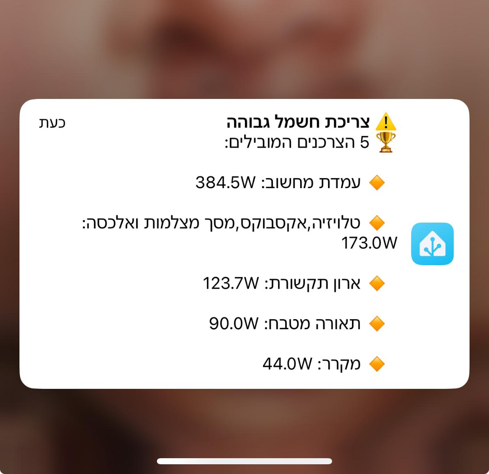

# 🔥 Power Consumption Alert for Home Assistant

This guide will show you how to set up an **automation that sends a notification** with the **top 5 power-consuming devices** when total power consumption exceeds a certain threshold.

  

---

## 🛠️ Requirements
✅ **Power monitoring sensors for individual devices** (Shelly, Tasmota, Sonoff, etc.)  
✅ **Home Assistant with notification service configured (App, Telegram, etc.)**  
✅ **A sensor that aggregates total power consumption** (Step 1)  

---

## 💡 Step 1: Creating a Sensor for Total Power Consumption
We will define a **template sensor** that sums up power consumption from all monitored devices.

📌 **Add the following code to `configuration.yaml` under `template`:**

```yaml
template:
  - sensor:
      - name: "Total Power Consumption"
        unit_of_measurement: 'W'
        state_class: measurement
        device_class: power
        state: >
          {{ (
            states('sensor.boiler_power')|float(0) +  
            states('sensor.ac_power')|float(0) +  
            states('sensor.fridge_power')|float(0) +  
            states('sensor.oven_power')|float(0) +  
            states('sensor.washing_machine_power')|float(0)  
          ) | round(0) }}
```

### 📌 What does this sensor do?
✅ **Sums up the power usage of all monitored devices.**  
✅ **Allows setting up automations based on total power consumption.**  
✅ **You can add or remove devices according to your setup.**  

### 📌 What should you change?
➡️ Update the **sensor names** (`sensor.boiler_power`, `sensor.ac_power`, etc.) to match your actual power sensors.  
➡️ Add or remove sensors based on the devices you want to track.  

---

## 🔹 Step 2: Automation to Send a Notification with the Top 5 Consumers
This automation will trigger **when total power consumption exceeds a certain threshold (e.g., 8000W)**. It will find **the top 5 consumers** and send a notification with their names and power usage.

📌 **Add the following code to `automations.yaml`:**

```yaml
alias: "High Power Consumption Alert"
trigger:
  - platform: numeric_state
    entity_id: sensor.total_power_consumption
    above: 8000
action:
  - service: notify.mobile_app_noy_iphone16_pro
    data:
      title: "⚠️ High Power Consumption Alert"
      message: >-
        

        
        
          
          
            
          
        

        

        
          🏆 **Top 5 Power Consumers:**
          
          🔸 {{ item.name | replace("_", " ") | replace("Power Consumption", "") | trim }}: {{ item.value | round(1) }}W
          
        
          ❌ **No power consumption data found**
        
```

### 📌 What does this automation do?
✅ **Triggers when total power consumption exceeds 8000W.**  
✅ **Checks all monitored devices and sorts them by power usage.**  
✅ **Sends a notification with the top 5 power-consuming devices.**  

### 📌 What should you change?
➡️ Update **sensor names** (`sensor.boiler_power`, `sensor.ac_power`, etc.) to match your setup.  
➡️ Adjust the **threshold (`above: 8000`)** to a level suitable for your home.  
➡️ Change the **notification service (`notify.mobile_app_noy_iphone16_pro`)** to match your device.  

---

## 🚀 Summary
✅ **Created a sensor to monitor total power consumption.**  
✅ **Set up an automation that identifies the top 5 power-consuming devices.**  
✅ **Configured a notification system for real-time alerts.**  
✅ **Customizable based on your devices and alert preferences.**  

---
📣 **Join our Facebook group:**  **Home Assistant - קהילה ומדריכים** 
🔗 **https://www.facebook.com/groups/homeassistant.israel**  
