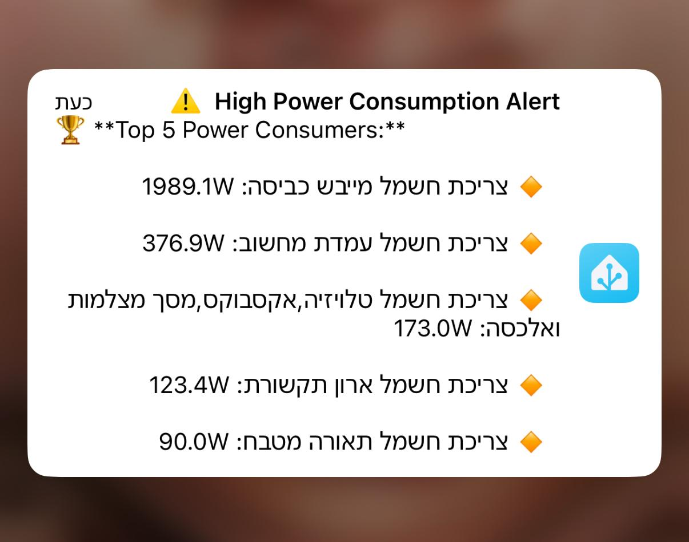
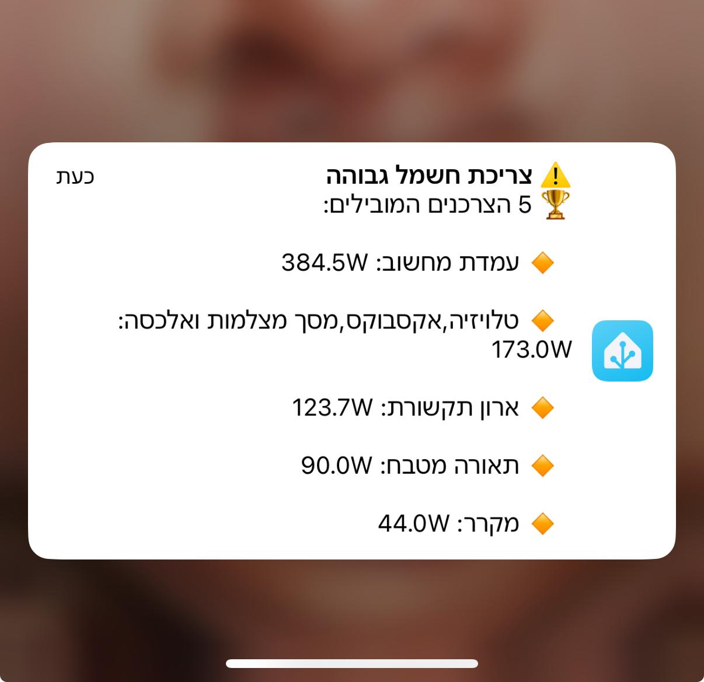

# 🔥 **התראה על צריכת חשמל גבוהה ב-Home Assistant**  

כיצד להגדיר **אוטומציה שתשלח התראה** עם **5 המכשירים הצורכים הכי הרבה חשמל** כאשר הצריכה הכוללת חורגת מסף מסוים.  

   

---

## 🛠️ **דרישות מקדימות**  
✅ **חיישנים שמודדים את צריכת החשמל של מכשירים שונים** (Shelly, Tasmota, Sonoff וכו')  
✅ **Home Assistant עם שירות התראות מוגדר (אפליקציה, טלגרם וכו')**  
✅ **חיישן שמרכז את צריכת החשמל הכוללת** (שלב 1)  

---

## 🔹 **שלב 1: יצירת חיישן לצריכת חשמל כוללת**  
נגדיר **חיישן Template** שיאגד את נתוני צריכת החשמל של כל החיישנים הביתיים.  

📌 **הוסף את הקוד הבא ל-`configuration.yaml` תחת `template`:**  

```yaml
template:
  - sensor:
      - name: "צריכת חשמל נוכחית"
        unit_of_measurement: 'W'
        state_class: measurement
        device_class: power
        state: >
          {{ (
            states('sensor.boiler_power')|float(0) +  
            states('sensor.ac_power')|float(0) +  
            states('sensor.fridge_power')|float(0) +  
            states('sensor.oven_power')|float(0) +  
            states('sensor.washing_machine_power')|float(0)  
          ) | round(0) }}
```

### 📌 מה עושה החיישן הזה?  
✅ **מאחד את הצריכה מכל חיישני החשמל הביתיים.**  
✅ **מאפשר להגדיר התראות ואוטומציות על הצריכה הכוללת.**  
✅ **ניתן להוסיף או להסיר מכשירים בהתאם לחיישנים שיש בבית.**  

### 📌 מה יש לשנות?  
➡️ עדכן את **שמות החיישנים** (`sensor.boiler_power`, `sensor.ac_power` וכו') בהתאם לחיישנים אצלך.  
➡️ הוסף או הסר חיישנים לפי המכשירים שברצונך לכלול.  

---

## 🔹 **שלב 2: יצירת אוטומציה לשליחת התראה עם 5 הצרכנים הגדולים**  
האוטומציה תפעל **כאשר הצריכה הכוללת חורגת מסף מסוים (למשל 8000W)**, תמצא **את 5 הצרכנים הגדולים** ותשלח התראה עם הפרטים שלהם.  

📌 **הוסף את הקוד הבא ל-`automations.yaml`:**  

```yaml
alias: "התראה על צריכת חשמל גבוהה"
trigger:
  - platform: numeric_state
    entity_id: sensor.total_power_consumption
    above: 8000
action:
  - service: notify.mobile_app_noy_iphone16_pro
    data:
      title: "⚠️ התראה על צריכת חשמל גבוהה"
      message: >-
        

        
        
          
          
            
          
        

        

        
          🏆 **5 הצרכנים המובילים:**
          
          🔸 {{ item.name | replace("_", " ") | replace("צריכת חשמל", "") | trim }}: {{ item.value | round(1) }}W
          
        
          ❌ **לא נמצאו נתוני צריכה**
        
```

### 📌 מה עושה האוטומציה?  
✅ **ברגע שהצריכה הכוללת עולה על 8000W, האוטומציה מופעלת.**  
✅ **בודקת את כל החיישנים שמודדים צריכת חשמל וממיינת אותם.**  
✅ **שולחת התראה עם 5 הצרכנים הגדולים.**  

### 📌 מה יש לשנות?  
➡️ עדכן את **שמות החיישנים** (`sensor.boiler_power`, `sensor.ac_power` וכו') לפי החיישנים אצלך.  
➡️ שנה את **סף הצריכה (`above: 8000`)** לערך שמתאים לבית שלך.  
➡️ שנה את **שירות ההתראות (`notify.mobile_app_noy_iphone16_pro`)** כך שיתאים למכשיר שלך (טלפון, טלגרם וכו').  

---

## 🚀 **סיכום**  
✅ **יצרנו חיישן מרכזי שמאגד את צריכת החשמל.**  
✅ **הגדרנו אוטומציה שתזהה את 5 הצרכנים הגדולים ותשלח התראה.**  
✅ **ניתן לשנות את החיישנים, סף ההתראה ואת צורת ההתראה לפי הצרכים שלך.**  


