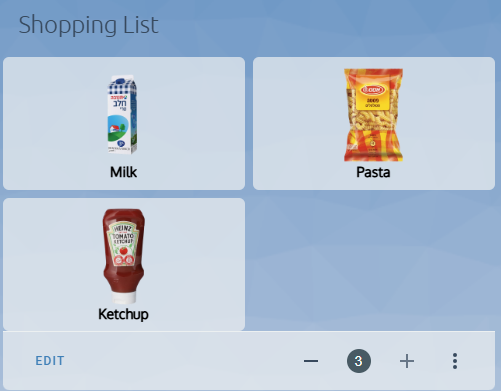
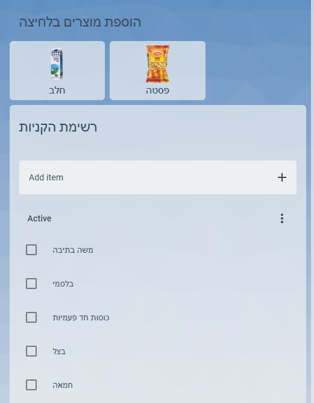

# 🛒 רשימת קניות חכמה ב-Home Assistant  
🚀 **הוספת מוצרים לרשימת הקניות בלחיצה אחת באמצעות כפתורים עם תמונות ושמות מוצרים!**  

כיצד ליצור **רשימת קניות חכמה ב-Home Assistant** עם **כפתורי מוצרים מותאמים אישית**, כולל **תמונות מקומיות**.  
כל לחיצה על מוצר **תוסיף אותו ישירות לרשימת הקניות** ב-Home Assistant.  

|  |  |
|--------------------------------------------|--------------------------------------------|

---

## **🛠️ דרישות מקדימות**  
✅ **הפעלת רכיב `shopping_list` ב-Home Assistant**  
✅ **התקנת `custom:button-card` דרך HACS**  
✅ **העלאת תמונות מוצרים לתיקייה `/local/`**  
✅ **הפעלת מצב YAML בלוח הבקרה של Lovelace (אם לא עובדים בממשק הגרפי)**  

---

## **🔹 שלב 1: הפעלת רשימת הקניות (`shopping_list`)**  
📌 ניתן להפעיל את רכיב רשימת הקניות **ישירות מהממשק הגרפי** (ללא עריכת קובץ `configuration.yaml`):  

1️⃣ **גש ל-`Settings` → `Devices & Services`**  
2️⃣ **לחץ על `+ Add Integration` (הוספת אינטגרציה חדשה)**  
3️⃣ **חפש "Shopping List" ובחר בה**  
4️⃣ **לחץ על `Submit` להשלמת ההתקנה**  

💡 **לאחר ההוספה, יש לבצע ריסטארט ל-Home Assistant כדי לוודא שהכל נטען כראוי!**  

📌 **אם אתה מעדיף להגדיר את הרשימה באופן ידני דרך `configuration.yaml`, הוסף את השורה הבאה:**  
```yaml  
shopping_list:  
```  

---

## **🔹 שלב 2: הוספת תמונות מוצרים ושימוש בהן**  
📌 כדי שהתמונות יוצגו נכון, יש **להעלות אותן ידנית** לתיקייה **הנכונה** במערכת Home Assistant.  

📌 **שלבים להעלאת התמונות:**  
1️⃣ **גש לתיקיית הקבצים של Home Assistant:**  
   - אם יש לך **גישה ישירה לשרת**, היכנס לתיקייה `/config/www/`.  
   - אם אתה **משתמש ב-File Editor ב-Home Assistant**, לחץ על `Browse Filesystem` ונווט לתיקיית `/config/www/`.

2️⃣ **העלה את תמונות המוצרים לתוך התיקייה `/config/www/`.**  
   - לדוגמה, אם יש לך **חלב, לחם וביצים**, קרא לקבצים:  
     ```
     milk.png
     bread.png
     eggs.png
     ```

3️⃣ **ודא שהגישה לתמונות נכונה על ידי פתיחת הקובץ דרך הדפדפן:**  
   - היכנס לכתובת:
     ```
     http://homeassistant.local:8123/local/milk.png
     ```
   - אם התמונה מוצגת, סימן שההעלאה הצליחה! ✅  

---

## **🔹 שלב 3: יצירת כפתורים להוספת מוצרים**  
כעת ניצור **כפתורים עם תמונות ושמות** שיאפשרו לך להוסיף מוצרים לרשימת הקניות בלחיצה אחת.

📌 **הוסף את הקוד הבא ל-Lovelace YAML:**  

```yaml  
type: grid  
title: "רשימת קניות"  
columns: 2  
square: false  
cards:  
  - type: custom:button-card  
    name: "חלב"  
    entity_picture: /local/milk.png  
    show_entity_picture: true  
    show_name: true  
    styles:  
      name:  
        - font-size: 14px  
        - font-weight: bold  
        - color: black  
    tap_action:  
      action: call-service  
      service: shopping_list.add_item  
      data:  
        name: חלב  

  - type: custom:button-card  
    name: "לחם"  
    entity_picture: /local/bread.png  
    show_entity_picture: true  
    show_name: true  
    styles:  
      name:  
        - font-size: 14px  
        - font-weight: bold  
        - color: black  
    tap_action:  
      action: call-service  
      service: shopping_list.add_item  
      data:  
        name: לחם  

  - type: custom:button-card  
    name: "ביצים"  
    entity_picture: /local/eggs.png  
    show_entity_picture: true  
    show_name: true  
    styles:  
      name:  
        - font-size: 14px  
        - font-weight: bold  
        - color: black  
    tap_action:  
      action: call-service  
      service: shopping_list.add_item  
      data:  
        name: ביצים  
```  

📌 **מה הקוד עושה?**  
✅ **כל כפתור מציג תמונה של המוצר עם שם מתחת**  
✅ **בלחיצה, המוצר נוסף לרשימת הקניות אוטומטית**  
✅ **התמונות מאוחסנות מקומית בתיקיית `/local/`**  
✅ **השמות מוצגים בגופן מודגש בצבע שחור**  

---

## **🔹 שלב 4: הצגת רשימת הקניות בלוח הבקרה**  
📌 ניתן להוסיף כרטיס רשימת קניות ישירות מהממשק הגרפי (GUI) כך:  


📌 **במצב YAML, ניתן להוסיף את הכרטיס ידנית כך:**  

```yaml  
type: shopping-list  
title: "רשימת הקניות שלי"  
```  

📌 **כל מוצר שנוסף יופיע באופן אוטומטי בראש הרשימה!**  

---

## **🔹 שלב 5: שיפור עיצוב הממשק**  
כדי לארגן את הממשק בצורה נוחה, נשתמש ב`vertical-stack` כדי **להציג את הכפתורים מעל הרשימה**:  

```yaml  
type: vertical-stack  
cards:  
  - type: grid  
    title: "הוספת מוצרים בלחיצה"  
    columns: 2  
    square: false  
    cards:  
      - (הכפתורים שהוספת קודם)  

  - type: shopping-list  
    title: "רשימת הקניות"  
```  

📌 **מה היתרונות של עיצוב זה?**  
✅ **כפתורי ההוספה מופיעים בראש הדף**  
✅ **הרשימה מוצגת מתחת לכפתורים**  
✅ **ניתן להוסיף מוצרים ולראות אותם מיד ברשימה**  

---

## **🚀 סיכום**
✅ **לחיצה על כפתור מוצר מוסיפה אותו לרשימת הקניות**  
✅ **כפתורים מעוצבים עם תמונות מקומיות ושמות מתחת**  
✅ **המוצרים החדשים מופיעים בראש הרשימה**  
✅ **ניתן להפעיל את רשימת הקניות ישירות מה-GUI ללא צורך ב-`configuration.yaml`**  
✅ **שימוש בפריסה נוחה עם `grid` ו-`shopping-list`**  

📬 **יש שאלות או שיפורים? ספרו בתגובות!**  

---
📣 **הצטרפו לקבוצת הפייסבוק שלנו:**  **Home Assistant - קהילה ומדריכים!**   
🔗 **https://www.facebook.com/groups/homeassistant.israel**
